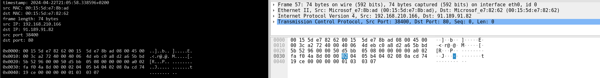
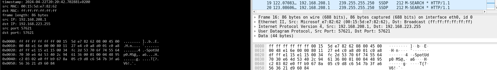
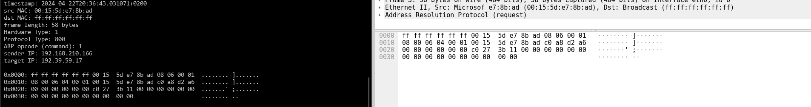
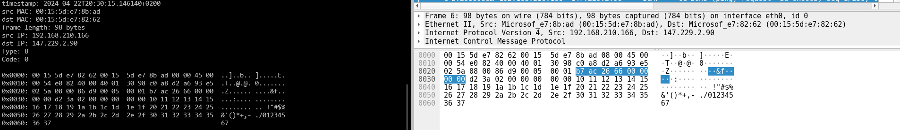
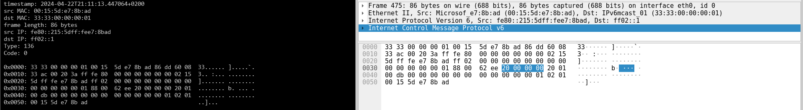

# IPK Project 2 - ZETA: Network sniffer
Cílem projektu je implementovat program, schopný monitorovat a filtrovat pakety na konkrétním síťovém zařízení a získat za tuto implementaci alespoň 10 bodů.

### Obsah
- Spuštění programu
- Funkcionalita programu
- - Hlavní tělo programu
- - Analýza paketů
- - Linková vrstva
- - Síťová vrstva
- - Transportní vrstva
- Soubor testů
- Zdroje

## Spuštění programu
Příkaz pro spuštění programu a jeho argumenty spuštění jsou společně s parametry definovány takto:

    ./ipk-sniffer [-i interface | --interface interface] {-p|--port-source|--port-destination port [--tcp|-t] [--udp|-u]} [--arp] [--ndp] [--icmp4] [--icmp6] [--igmp] [--mld] {-n num}  

Detailní popis argumentů a jejich funkce je zde v tabulce:
| Argument           |               | Parametr    | Popis                                                                                                           |
|:-------------------|:--------------|:------------|:----------------------------------------------------------------------------------------------------------------|
| -i                 | --interface   | interface   | Název zařízení které chceme monitorovat. Pokud název není specifikován, je zobrazen seznam dostupných zařízení. |
| -t                 | --tcp         |             | Pouze TCP segmenty                                                                                              |
| -u                 | --udp         |             | Pouze UDP segmenty                                                                                              |
| -p                 |               | port_number | Pouze pakety s tímto zdrojovým nebo cílovým portem                                                              |
| --port-destination |               | port_number | Pouze pakety s tímto cílovým portem                                                                             |
| --port-source      |               | port_number | Pouze pakety s tímto zdrojovým portem                                                                           |
| --arp              |               |             | Pouze ARP rámce                                                                                                 |
| --icmp4            |               |             | Pouze ICMPv4 pakety                                                                                             |
| --icmp6            |               |             | Pouze ICMPv6 pakety typu echo a response                                                                        |
| --ndp              |               |             | Pouze pakety protokolu NDP                                                                                      |
| --mlp              |               |             | Pouze pakety protokolu MLP                                                                                      |
| --igmp             |               |             | Pouze IGMP pakety                                                                                               |
| -h                 | --help        |             | Vytiskne manuál                                                                                                 |

Argumenty lze při spuštění definovat v jakémkoli pořadí. Pokud nejsou definovány žádné argumenty, program vypíše seznam dostupných síťových zařízení. Zařízení pro sledování lze definovat argumentem ````-i````, přičemž nelze definovat více než jedno zařízení. Argumenty ````-p````, ````--port-destination````, ````--port-source```` rozšiřují argumenty ````-t / --tcp````, ````-u / --udp````. Jejich použití bez argumentů ````-t / --tcp````, ````-u / --udp```` nemá žádný efekt. Dále použítí ````-p```` společně s ````--port-destination```` nebo ````--port-source```` vyústí v chybu programu. NDP a MLP jsou podprotokoly síťového protokolu ICMPv6, použití argumentů ````--ndp````, ````--mlp```` zároveň propouští pouze pakety ICMPv6.

## Funkcionalita programu
### Hlavní tělo programu
Program začíná zpracováním argumentů. Na začátku jsou definovány dvě důležité proměnné, ````devs```` - ukazatel na strukturu dostupných zařízení a ````arg_options```` - struktura dlouhých argumentů, které rozšiřuje klasické jednoznakové argumenty. Níže cyklus while() zpracovává argumenty zleva, doprava. Po jejich zpracování následuje kontrola, zda je jejich kombinace společně s parametry korektní.

Ještě před zachycováním paketů se nastaví jak má program zpracovávat signály od OS (````SIGINT````, ````SIGTERM````, ````SIGQUIT````).
K hlavnímu účelu programu se používá struktura ````pcap_t```` , kterou používají ostatní funkce z knihovny libpcap. Proměnná se inicializuje funkcí ````get_hadle()````. Ta jí přidělí adresu a síťovou masku zařízení, nastaví ji do "promiscuous mode" a sestaví filtrační řeťezec, podle něhož budou další pcap funkce filtrovat příchozí, nebo odchozí pakety.

Řeťezové zachytávání paketů provádí pcap funkce ````pcap_loop()````. Pokud uživatel nedefinoval počet paketů k vytištění, vytiskne se první zachycený paket. Pokud uživatel nastavil počet paketů na 0 nebo -1, program tiskne zachycené pakety, dokud není ukončen.

### Analýza paketů
Při analýze paketů program zkoumá hlavičky jednotlivých vrstev komunikace. Ukazatel na začátek hlavičky v každé vrstvě je uložen v ````packet_ptr```` a inkrementuje se o velikost hlavičky vždy při přechodu analýzy do nižší vrstvy. Pokud analýza v jakékoli vrstvě narazí protokol který nepodporuje, zbytek analýzy se přeskočí a na výstup se vytiskne bajtová reprezentace rámce. Podporované protokoly jsou vypsány níže.

Každý vytišťený paket je také opatřený informací o velikosti rámce a časovou značku ve standartu RFC 3339.
#### Linková vrstva
V této vrstvě nás zajímá zdrojová a cílová MAC adresa. Podporované protokoly jsou:  
- Ethernet II  
- Linux cooked

#### Síťová vrstva
V teto vrstvě nás zajímá zdrojová a cílová IP adresa. Podporované protokoly jsou:  
- IPv4
- IPv6
- ARP   

Pozn.: Z praktických důvodů byl protokol ARP zařazen do této vrstvy

#### Transportní vrstva
V této vrstvě nás zajímají zdrojové a cílové porty protokolů TCP a UDP, nebo typ a kód ICMPv4, ICMPv6 a IGMP protokolů. Podporované protokoly jsou:  
- TCP
- UDP
- ICMPv4
- ICMPv6
- IGMP
- MLP
- NDP

Pozn.: ICMPv4, ICMPv6 a IGMP jsou sice podle ISO/OSI řazeny mezi síťové protokoly, ale pro přehlednost a jednoduchost programu byla jejich analýza přesunuta o vrstvu níže.

## Soubor testů
Program byl testován pomocí utilit ````ping````, ````ndsend```` a programu Wireshark. Následující testy obsahují vždy použitý příkaz a porovnání výstupu programu s Wireshark GUI.

````sudo ./ipk-sniffer -i eth0 --tcp````


````sudo ./ipk-sniffer -i eth0 --udp````
   

````sudo ./ipk-sniffer -i eth0 --arp````
   

````sudo ./ipk-sniffer -i eth0 --icmp4````  
    

````sudo ./ipk-sniffer -i eth0 --ndp````    
    

## Zdroje
Následující seznam obsahuje odkazy na stránky a články ze kterých bylo během vzniku projektu čerpáno.

- TCPDUMP/LIBPCAP public repository: https://www.tcpdump.org/
- Programming with PCAP: https://www.tcpdump.org/pcap.html
- PCAP man pages: https://www.tcpdump.org/manpages/
- PCAP LINK-LAYER HEADER TYPES" https://www.tcpdump.org/linktypes.html

- The Open Group. netinet/in.h - Internet address family, IEEE Std 1003.1, 2004 Edition. Published 2004-08-23 [cit. April 22, 2024]. Dostupné online:
https://man7.org/linux/man-pages/man7/ip.7.html

- Wikipedia contributors. Ethernet frame. Wikipedia. Published April 13, 2024 [cit. April 22, 2024]. Dostupné online:  
https://en.wikipedia.org/wiki/Ethernet_II

- Wikipedia contributors. Internet Protocol version 4. Wikipedia. Published April 18, 2024 [cit. April 22, 2024]. Dostupné online:  
https://en.wikipedia.org/wiki/Internet_Protocol_version_4

- Wikipedia contributors. IPv6. Wikipedia. Published April 21, 2024 [cit. April 22, 2024]. Dostupné online:  
https://en.wikipedia.org/wiki/IPv6

- Wikipedia contributors. Address Resolution Protocol. Wikipedia. Published January 27, 2024 [cit. April 22, 2024]. Dostupné online:  
https://en.wikipedia.org/wiki/Address_Resolution_Protocol

- Wikipedia contributors. Transmission Control Protocol. Wikipedia. Published April 18, 2024 [cit. April 22, 2024]. Dostupné online:  
https://en.wikipedia.org/wiki/Transmission_Control_Protocol

- Wikipedia contributors. User Datagram Protocol. Wikipedia. Published April 16, 2024 [cit. April 22, 2024]. Dostupné online:  
https://en.wikipedia.org/wiki/User_Datagram_Protocol

- Wikipedia contributors. Internet Control Message Protocol. Wikipedia. Published April 9, 2024 [cit. April 22, 2024]. Dostupné online:  
https://en.wikipedia.org/wiki/Internet_Control_Message_Protocol

- Wikipedia contributors. ICMPv6. Wikipedia. Published June 25, 2023 [cit. April 22, 2024]. Dostupné online:  
https://en.wikipedia.org/wiki/ICMPv6

- Wikipedia contributors. Internet Group Management Protocol. Wikipedia. Published April 8, 2024 [cit. April 22, 2024]. Dostupné online:  
https://en.wikipedia.org/wiki/Internet_Group_Management_Protocol